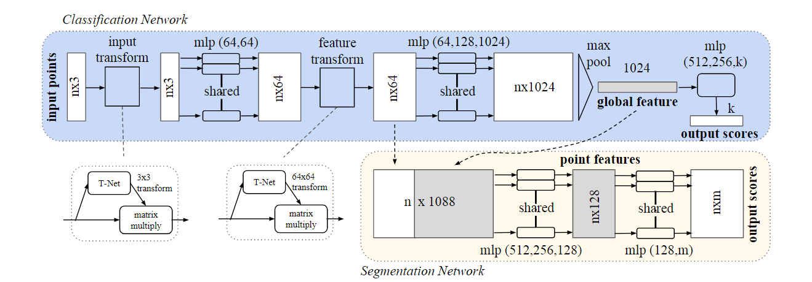
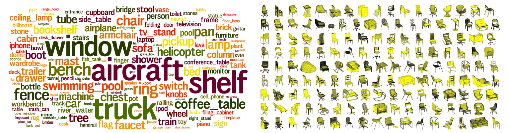

# PointNet-with-ModleNet40
基于深度学习的3D点云数据处理——开上之作PointNet模型【Pytorch版】

## 一、项目介绍
点云数据是一种三维坐标的数据集合，广泛存在于激光扫描、自动驾驶、增强现实等应用领域，其中包含丰富的目标轮廓信息，基于深度学习的3D点云数据处理已成为计算机视觉的重要组成部分。PointNet开创性的提出了一种新型深度神经网络结构，解决了点云数据的无序性、非结构性和置换不变性，能够应用在点云分类、点云分割和场景分割的视觉任务中。本项目使用Pytorch搭建模型训练环境，在ModelNet40数据集上的分类精度为TODO。

### 1.1 PointNet模型

- Classification Network 和 Segmentation Network 两个部分组成，分别应用于点云分类和点云分割任务。
- 输入维度`n×3`，输出维度`n×k`或`n×m`，其中`n`为点云个数，`m`为分类类别数，`k`为分割类别数。
- T-Net空间旋转变换，mlp多层感知机，max pool全局池化层，global feature特征融合。

### 1.2 数据集

- 左图为三维模型类别词云：右图为chair三维模型可视化。
- 数据集下载地址：[ModelNet40](https://shapenet.cs.stanford.edu/media/modelnet40_normal_resampled.zip)
- 类型名称列表：airplane，bathtub，bed，bench，bookshelf，bottle，bowl，car，chair，cone，cup，curtain，desk，door，dresser，flower_pot，glass_box，guitar，keyboard，lamp，laptop，mantel，monitor，night_stand，person，piano，plant，radio，range_hood，sink，sofa，stairs，stool，table，tent，toilet，tv_stand，vase，wardrobe，xbox。
```
./data/modelnet40_normal_resampled/
  |--airplane
    |--airplane_0001.txt
    |--airplane_0002.txt
    |--……
  |--bathtub
    |--bathtub_0001.txt
    |--bathtub_0002.txt
    |--……
  |--……
  |--filelist.txt #文件目录
  |--modelnet10_shape_name.txt  # modelnet10类别名
  |--modelnet10_train.txt       # modelnet10训练集
  |--modelnet10_test.txt        # modelnet10测试集
  |--modelnet40_shape_name.txt  # modelnet40类别名
  |--modelnet40_train.txt       # modelnet40训练集
  |--modelnet40_test.txt        # modelnet40测试集
```

### 1.3 数据增强
数据增强扩大训练样本数量，提升模型泛化能力，有效避免过拟合。选择合适的数据增强策略能提升模型精度，本项目提供几种常用点云数据增强函数，保存在`provider.py`文件中。
- normalize_data：归一化
- rotate_point_cloud：空间坐标旋转，α、β、γ轴
- jitter_pointnet_cloud：添加高斯噪声
- shift_pointnet_cloud：空间坐标平移，x、y、z轴
- random_scale_point_cloud：随机缩放
- random_point_dropout：随机正则化

## 二、项目运行


## 三、项目总结


## 四、参考引用
